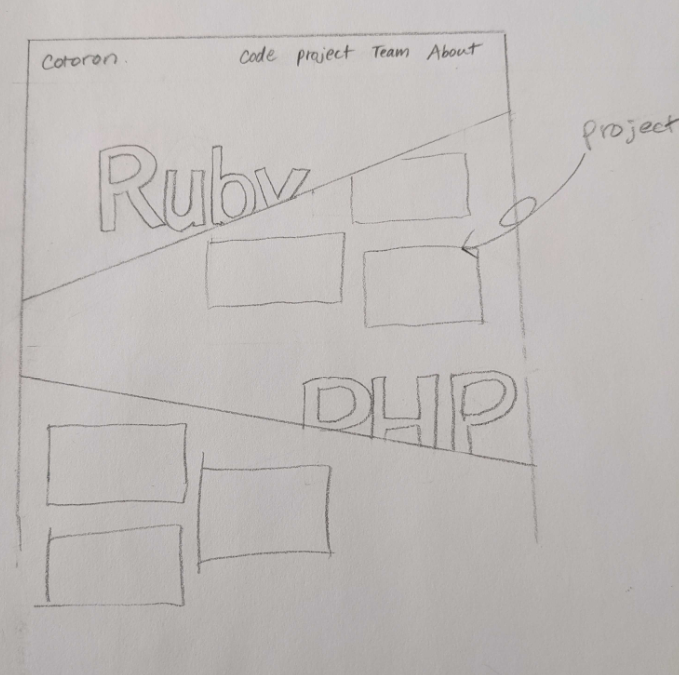
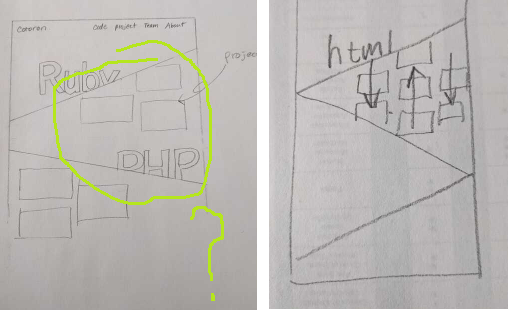
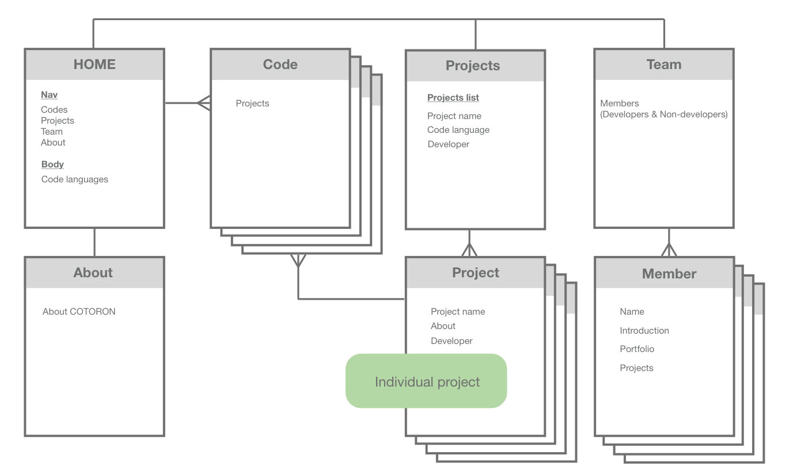
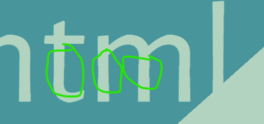

# COTORON

# Sphere Of Activity Color Scheme | Colours

- Zomp (#3F969C)
- Jet Stream (#B0D2C0)
- Eggshell (#F0EBD8)
- Terra Cotta (#E47E64)
- Sunray (#EEB35A)

> Sphere Of Activity Color Scheme
> The Sphere Of Activity Color Scheme palette has 5 colors which are Zomp (#3F969C), Jet Stream (#B0D2C0), Eggshell (#F0EBD8), Terra Cotta (#E47E64) and Sunray (#EEB35A).

> This color combination was created by user Keshav Naidu. The Hex, RGB and CMYK codes are in the table below.

> Note: English language names are approximate equivalents of the hexadecimal color codes.

- https://www.schemecolor.com/
  - https://www.schemecolor.com/nature-in-retro-colors.php
  - https://www.schemecolor.com/links-anchors.php
  - https://www.schemecolor.com/sphere-of-activity.php *

## Layout

Webpage follow layout by [Sabi08](https://github.com/Sabi08)



with some shortocomings as we wanted scrollable



& sitemap



## Fonts

We had some font no no



started with:
```
@import url('https://fonts.googleapis.com/css2?family=Alegreya+Sans&display=swap')
@import url('https://fonts.googleapis.com/css2?family=Nunito+Sans&display=swap')

$fonta: 'Alegreya Sans', sans-serif
$fontb: 'Nunito Sans', sans-serif
```

ended with
```
@import url('https://fonts.googleapis.com/css2?family=Istok+Web&display=swap')
@import url('https://fonts.googleapis.com/css2?family=Nunito+Sans&display=swap')

$fonta: 'Istok Web', sans-serif
$fontb: 'Nunito Sans', sans-serif
```